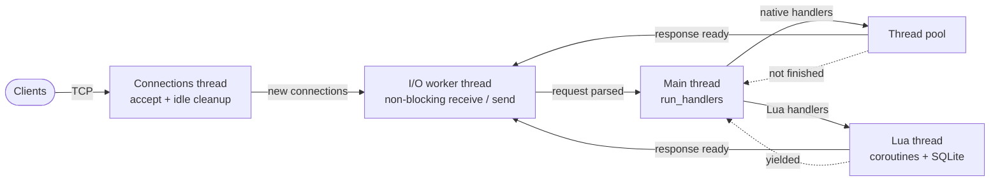

# Concurrency Networking


A concurrent HTTP server written in C++20 on top of Winsock2. It serves static files and runs endpoints written in Lua (as coroutines, with SQLite access), using a dedicated I/O thread, a thread pool and bounded producer/consumer queues.

## Contents

- [Features](#features)
- [Requirements](#requirements)
- [Build](#build)
- [Quick start](#quick-start)
- [Writing endpoints in Lua](#writing-endpoints-in-lua)
- [How it works](#how-it-works)
- [Tests](#tests)
- [Project structure](#project-structure)
- [Known limitations](#known-limitations)
- [Credits](#credits)
- [License](#license)

## Features

- **Non-blocking I/O on a dedicated thread:** every connection is a small state machine (receive request → run handler → write header → write body → close).
- **Thread pool for native handlers:** sized to `std::thread::hardware_concurrency()`; the static file server runs there.
- **Lua endpoints as coroutines:** a single Lua thread owns the VM, and each `coroutine.yield()` lets other requests make progress.
- **SQLite from Lua:** `database.execute` and `database.query` with `?` placeholders (nil, boolean, number and string arguments).
- **Static file server:** MIME type lookup by extension and a path-traversal guard that rejects paths resolving outside the served directory.
- **Idle connection cleanup:** connections inactive for more than 10 s are closed (swept every 2 s).
- **Graceful shutdown:** `Ctrl+C` (SIGINT/SIGTERM) and Windows console close/logoff/shutdown events stop the server cleanly.
- **Reusable library:** `network-library` is a standalone static library with Winsock2 wrappers (TCP/UDP sockets, addresses, ports), an HTTP request parser, a response serializer, a thread pool and a bounded blocking queue.

## Requirements

| Component | Requirement |
|---|---|
| Operating system | Windows 10/11, x64 (the only network backend is Winsock2) |
| IDE / compiler | Visual Studio 2026 (project files use `VCProjectVersion` 18.0) with the MSVC **v143** toolset and a Windows 10/11 SDK |
| Language standard | C++20 (`std::jthread`, `std::latch`, `std::stop_token`, `std::span`) |
| NuGet package | `Microsoft.Windows.CppWinRT` 2.0.220531.1 (restored by Visual Studio) |
| Third-party libraries | Lua **5.5.0** and SQLite **3.53.0**, as x64 static libraries (see below) |
| Tools | Git; `curl.exe` to try the examples |

> [!IMPORTANT]
> The Lua and SQLite **static libraries are not in the repository** (`*.lib` is git-ignored); only their headers are. The linker expects these files, so you must build them from the Lua 5.5.0 and SQLite 3.53.0 sources and place them here:
>
> | File | Location |
> |---|---|
> | `lua-debug.lib`, `lua-release.lib` | `Concurrency Networking/http-server/libraries/lua/lib/vs-2026/x64/` |
> | `sqlite-static-debug.lib`, `sqlite-static-release.lib` | `Concurrency Networking/http-server/libraries/sqlite/lib/vs-2026/x64/` |
>
> Build Lua as **C** code (its headers are wrapped in `extern "C"` by `lua.hpp`) and leave out `lua.c` and `luac.c`, which contain their own `main`.

## Build

```powershell
git clone https://github.com/Izana-L/Concurrency-Networking.git
cd Concurrency-Networking
```

1. Put the four `.lib` files in place (see the note above).
2. Open `Concurrency Networking/http-server/projects/visual-studio-2026/http-server.slnx` in Visual Studio.
3. Select **x64** and **Debug** or **Release**, then build. The solution builds `network-library` first and links it into `http-server`.

> [!WARNING]
> Open `http-server.slnx`, not `network-library.slnx`. The library project looks for the CppWinRT NuGet package inside the `http-server` folder, so building the library on its own fails with "missing NuGet package".

> [!TIP]
> The top-level folder is called `Concurrency Networking` (with a space). Quote the path in your shell.

## Quick start

Run the server from the `http-server/projects/visual-studio-2026` folder: the paths in `main.cpp` (`../../examples/...`) are relative to the working directory. Visual Studio does this by default when you press `F5`; from a terminal:

```powershell
cd "Concurrency Networking\http-server\projects\visual-studio-2026"
.\x64\Release\http-server.exe
```

You should see:

```text
Running HTTP server on port 80...
```

Then, from another terminal (use `curl.exe`: in Windows PowerShell `curl` is an alias of `Invoke-WebRequest`):

```powershell
curl.exe http://localhost/hello                      # Lua endpoint
curl.exe http://localhost/users                      # list rows from SQLite
curl.exe http://localhost/users/<id>                 # one row, <id> taken from the list above
curl.exe -X POST -d "name=Carol&email=carol@example.com&score=88" http://localhost/users
curl.exe -X DELETE http://localhost/users/<id>
```

Open `http://localhost/` in a browser to see the static demo site. Press `Ctrl+C` in the server console to stop it.

Typical output:

```text
> curl.exe http://localhost/hello
Hello from the bridge! Method: GET | Agent: curl/8.x     (the version depends on your curl)

> curl.exe http://localhost/users
136 | Alice | alice@example.com | 95.5
137 | Bob | bob@example.com | 80.0
138 | Eve | eve@example.com | 73.2

> curl.exe http://localhost/users/136
name=Alice email=alice@example.com score=95.5
```

The ids depend on how many times the server has been started, because the table uses `AUTOINCREMENT`.

> [!WARNING]
> `examples/lua-server/main.lua` runs `DELETE FROM users` and re-inserts three sample rows **every time the server starts**, and `database.bin` is a tracked file, so your local runs show up as changes in `git status`.

> [!NOTE]
> The port is fixed at **80** (`Port port{ 80 }` in `http-server/code/main.cpp`). If another program is using it (IIS, another web server), change it there and rebuild.

## Writing endpoints in Lua

`main.lua` is loaded once at startup and registers routes through the global `server` table. A handler receives a `request` and a `response` and runs as a coroutine:

```lua
server.route ("GET", "/hello", function (request, response)

    coroutine.yield ()   -- give other requests a chance to run

    local message = "Hello from the bridge! Method: " .. request:get_method ()

    response:status     (200)
    response:header     ("Content-Type",   "text/plain; charset=utf-8")
    response:header     ("Content-Length", #message)
    response:header     ("Connection",     "close")
    response:end_header ()
    response:body       (message)

end)
```

| API | Description |
|---|---|
| `server.route (method, path, handler)` | Registers `handler (request, response)`. `method` is a string: `OPTIONS`, `HEAD`, `GET`, `POST`, `PUT`, `LINK`, `UNLINK`, `DELETE` or `TRACE`. `path` must start with `/`; a path ending in `/` (e.g. `/users/`) is a prefix route that also matches `/users/136`. |
| `request:get_method ()`, `get_path ()`, `get_query ()`, `get_fragment ()`, `get_protocol ()` | Parts of the request line. |
| `request:get_header (name)`, `request:get_body ()` | A header value and the raw request body. |
| `response:status (code)`, `header (name, value)`, `end_header ()`, `body (text)` | Build the response in this order: status, headers, `end_header`, body. |
| `database.execute (sql, args)` | Runs a statement. `args` is an optional table of positional `?` values. |
| `database.query (sql, args)` | Returns a row cursor: `row:advance ()` moves to the next row; `row:get_integer (i)`, `row:get_string (i)` and `row:get_real (i)` read column `i` (1-based). |
| `coroutine.yield ()` | Hands control back to the server so other requests can progress. |

The database file is `database.bin`, created next to `main.lua` the first time a script uses `database`. See `http-server/examples/lua-server/main.lua` for complete GET, POST and DELETE examples.

## How it works

Five kinds of threads cooperate through bounded queues:



| Thread | Code | Job |
|---|---|---|
| Main | `HttpServer::run_handlers` | Pops connections whose request is ready and dispatches them to the thread pool or to the Lua thread. |
| Connections | `HttpServer::accept_and_close_inactive_connections` | Accepts new sockets; closes finished or idle (> 10 s) connections every 2 s. |
| I/O worker | `HttpServer::concurrent_transfer_data` | Receives requests and sends responses on all active non-blocking sockets. |
| Lua | `Thread_Directory::consume_lua_funtions` | The only thread that touches the Lua VM and SQLite. |
| Pool | `Thread_Pool` | Runs native handlers such as `StaticFileServer`. |

Each connection carries a `ConnectionContext` with an atomic state (`RECEIVING_REQUEST` → `RUNNING_HANDLER` → `HANDLER_IN_PROGRESS` → `WRITING_RESPONSE_HEADER` → `WRITING_RESPONSE_BODY` → `CLOSED`) and an atomic lifecycle flag (`IDLE`, `PROCESSING`, `CLOSING`, `CLOSED`) so only one thread works on a connection at a time.

Once a request is parsed, the server asks the registered handler factories in order: Lua routes first, then the static file server. If none matches, it answers `404 File not found`. A handler returns `true` from `process ()` when its response is complete; otherwise (for example after a `coroutine.yield ()`) the connection goes back to the queue and the handler runs again later.

## Tests

There are no automated tests yet. To smoke-test a build, run the `curl.exe` commands from [Quick start](#quick-start) and check that the responses match.

## Project structure

```text
Concurrency-Networking/
└── Concurrency Networking/
    ├── network-library/                   # Static library: sockets, HTTP, threading
    │   ├── code/headers/                  # Public headers (HttpServer, Thread_Pool, Circular_Queue, ...)
    │   ├── code/sources/                  # HTTP server, request parser, response serializer
    │   ├── code/sources/winsock2/         # Winsock2 backend (TCP/UDP sockets, addresses, setup)
    │   └── projects/visual-studio-2026/   # network-library project
    └── http-server/                       # Executable: library + Lua + SQLite + static files
        ├── code/                          # main.cpp, LuaServerApplication, StaticFileServer, Sqlite, SignalHandler
        ├── examples/
        │   ├── lua-server/                # main.lua (routes) and database.bin (SQLite file)
        │   └── static-website/            # Demo site served at /
        ├── libraries/                     # Third-party: lua/, luastate/, sqlite/ (headers only)
        └── projects/visual-studio-2026/   # http-server.slnx: open this one
```

## Known limitations

- **Windows only:** `network-library` has a Winsock2 backend and nothing else.
- **Hard-coded settings:** port 80 and the paths to the Lua script and the static site are set in `main.cpp`.
- **One request per connection:** every response is sent with `Connection: close`; there is no keep-alive.
- **Static files are read into memory** in one go before being sent.
- **Chunked request bodies** are only handled minimally: the parser assumes the body ends with `0\r\n\r\n`.
- **Lua lifetime caveat** (documented as `TO DO` in `LuaServerApplication.cpp`): the `request`, `response` and row tables wrap native pointers, so a handler must not keep them after it finishes.

## Credits

<!-- TODO: add author name, course and tutor/lecturer if this is an academic project. -->

- **Repository:** [Izana-L/Concurrency-Networking](https://github.com/Izana-L/Concurrency-Networking)
- Several source files carry the header `Copyright (c) 2026 Ángel`; `Circular_Queue.hpp` is distributed under the [Boost Software License 1.0](https://www.boost.org/LICENSE_1_0.txt).

Third-party libraries (they keep their own licenses; see the files in `http-server/libraries/`):

- [Lua](https://www.lua.org) 5.5.0 — MIT license
- [SQLite](https://sqlite.org) 3.53.0 — public domain
- [LuaState](https://github.com/AdUki/LuaState) 2.1 by AdUki, adapted here for Lua 5.5 — Apache License 2.0

## License

<!-- TODO: choose a license and add a LICENSE file. -->

No `LICENSE` file has been added to this repository yet, so by default all rights are reserved. Third-party code under `http-server/libraries/` keeps its original license.
